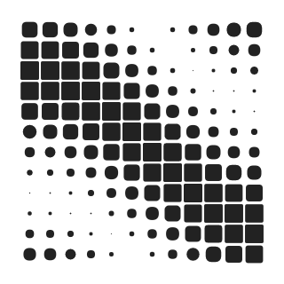
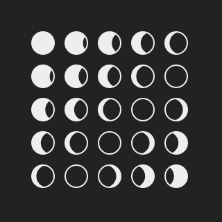
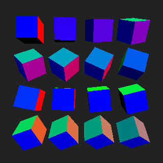
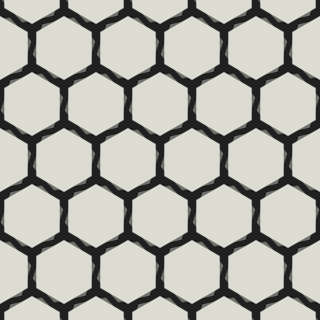

# Minimal web animations with p5.js

# Inspiration

#### [FLRN GIF](http://gif.flrn.nl/)

#### [FLRN Minimal](http://art.flrn.nl/)
Not animations, but would be great as animations  

#### [Echophon](http://echophon.tumblr.com/)

#### [Light Process](http://lightprocesses.tumblr.com/)

#### [Kyle Stewart](http://kylerstewart.tumblr.com/)

## Getting Started

+ Copy template example `examples/00-template` into a new directory
+ Open terminal and `cd` into your new directory
+ Start a new server with `python -m SimpleHTTPServer` and point your browser to http://localhost:8000
  + or simply open `index.html` in your web browser (GIF export will not work in this case)
+ Fill out methods `prepare()` and `drawFrame()` with your custom animation
+ ...
+ Profit!

## Examples
Projects included in the `examples` folder (with hopefully enough comments to make sense)

### Code Kitchen Live Coding Example [June 23rd 2016]
Today we are going to create...

### A note on GIF output
We need to use a simple HTTP server in order for GIF export to work - web workers don't work from `file://` due to browser security.

    $ python -m SimpleHTTPServer

__Some issues exist with export on retina displays__  
Haven't quite solved these yet, sorry.
