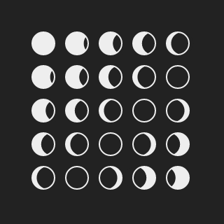
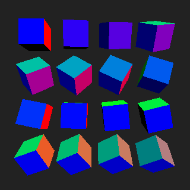

What are people's backgrounds?

Please interrupt with questions

What we are doing today
+ Animated GIFs
+ Show inspirations
+ Talk about challenges in #100Days
+ Going to be doing a livecoding example


## Examples





How to copy repo

Do a live coding example

Breakout to personal animations


(TODO: prep live coding example)
(TODO: make small window size example to do this)

## 01 - Simple Animation
Discuss how to code a scalable/time stretchable animation

```javascript
function drawFrame(perc) {
  background(backColor);

  // ....
}
```
